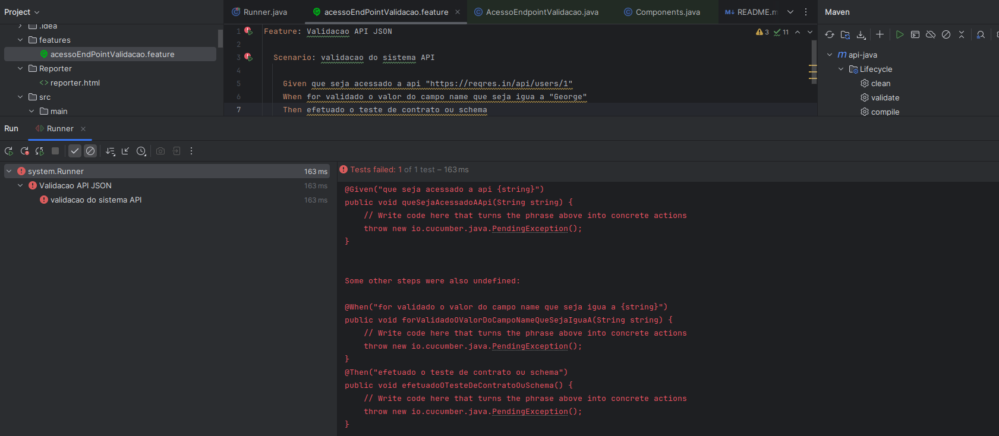
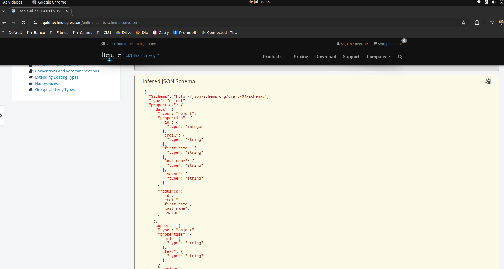
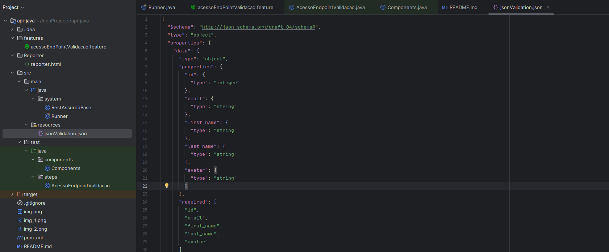
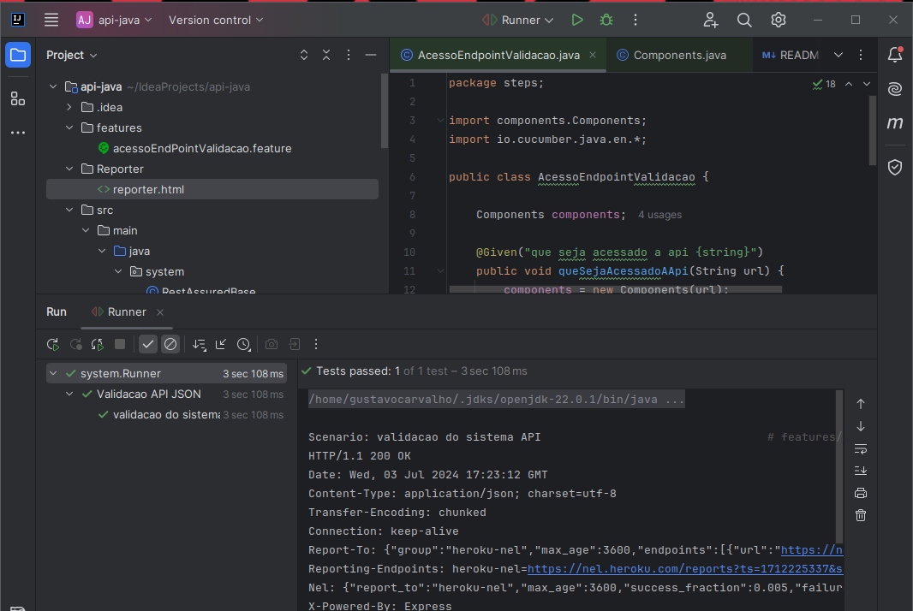
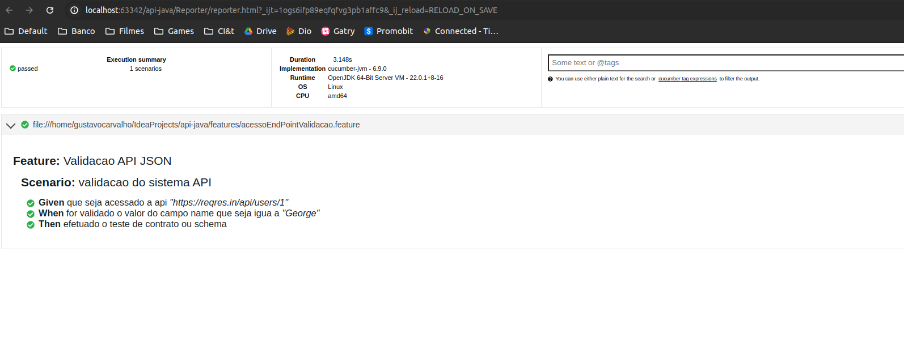

# Curso: Automated API Testing with Java and REST Assured (CI&T)

## Features (Rodar o clean install do Maven para compilar)

Ao executar uma feature ele mostra como criar os steps. 
  

URL TESTE: https://reqres.in/api/users/1  

## Gerando o Schema para validar o contrato

https://www.liquid-technologies.com/online-json-to-schema-converter  

  
  

## Reporter - Arquivo que é gerado com o relatório dos testes

  
  